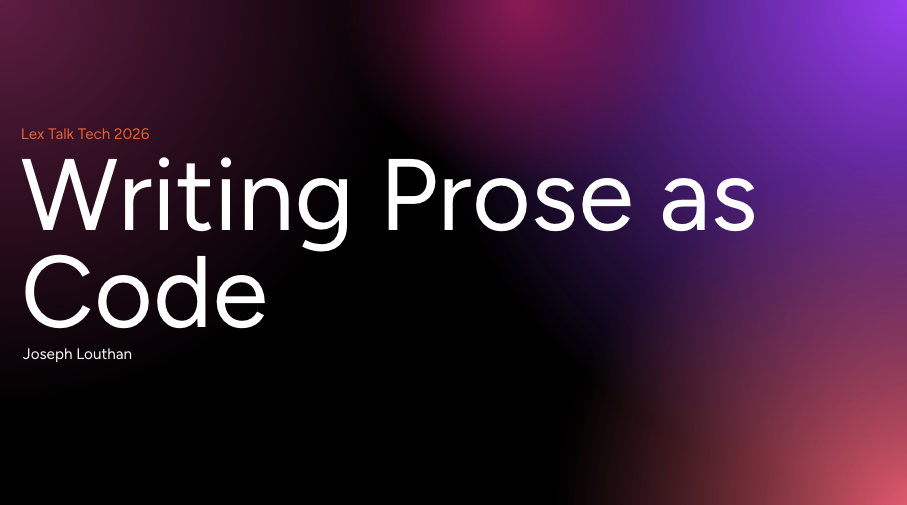

# Theologicus :: Some Expository Thoughts

Still no pen, no words, no image  
can express to you the loveliness  
of my only, only Lord Jesus.  
\- Samuel Rutherford
 
 
Hello! My name is Joseph L. Louthan, and I am trying to waste all of my time with God. Sarah's husband and my three children's papa. Lexington, KY.  Covenant member, bible study teacher, and elder candidate at [Reforming Truth Church](https://reformingtruth.church/). Once evangelical, now Reformed Baptist--[Second London Baptist Confession](https://theologic.us/confession-1689/).

Theologicus is a personal confession of faith--[devotional and expository thoughts](https://theologic.us)--on the Triune God and his great gospel. God's gospel is this: I have mightily sinned against the Holy God. Yet, this same God, in his tenderest mercies, sent his only begotten Son, Jesus Christ, to live as I should have, died in my place for my sins, paying the penalty I deserved, and rose again on the third day, conquering sin and death. I was once dead in my sins, but because of the same Spirit who raised Jesus from the dead dwells in me, I am fully alive in Christ.

>1 Timothy 1:12–17 I give thanks to Christ Jesus our Lord who has strengthened me, because he considered me faithful, appointing me to the ministry—even though I was formerly a blasphemer, a persecutor, and an arrogant man. But I received mercy because I acted out of ignorance in unbelief, and the grace of our Lord overflowed, along with the faith and love that are in Christ Jesus. This saying is trustworthy and deserving of full acceptance: 
>
>**“Christ Jesus came into the world to save sinners”—and I am the worst of them.**
>
>But I received mercy for this reason, so that in me, the worst of them, Christ Jesus might demonstrate his extraordinary patience as an example to those who would believe in him for eternal life. Now to the King eternal, immortal, invisible, the only God, be honor and glory forever and ever. Amen.

And if I have fifteen minutes to spare in my day, I'm intensely mediocre at [StarCraft 2](https://starcraft2.blizzard.com/en-us/).
 
 

## Talks

**[Writing Prose as Code](https://docs.google.com/presentation/d/1y8c2s9OyBcvazoSoTUZDPbIM3T6Yyq-4beeTq_eovTM/edit?usp=sharing)** - *given at [Lex Talk Tech 2026](https://lextalk.tech/)*

## Quid

## Ubi

## Quibus auxiliis

  

## Quomodo

## Quando

### Tools

  

## Cur

>Psalm 17:15 (CSB) But I will see your face in righteousness; when I awake, I will be satisfied with your presence.
